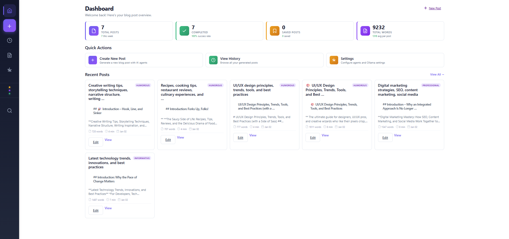
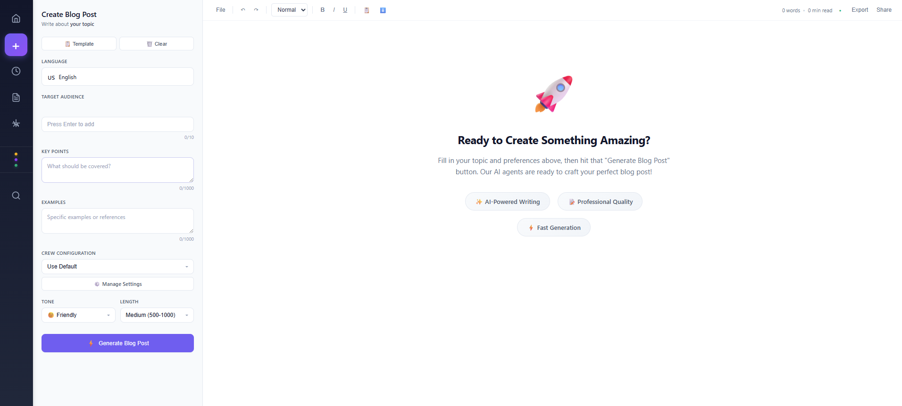
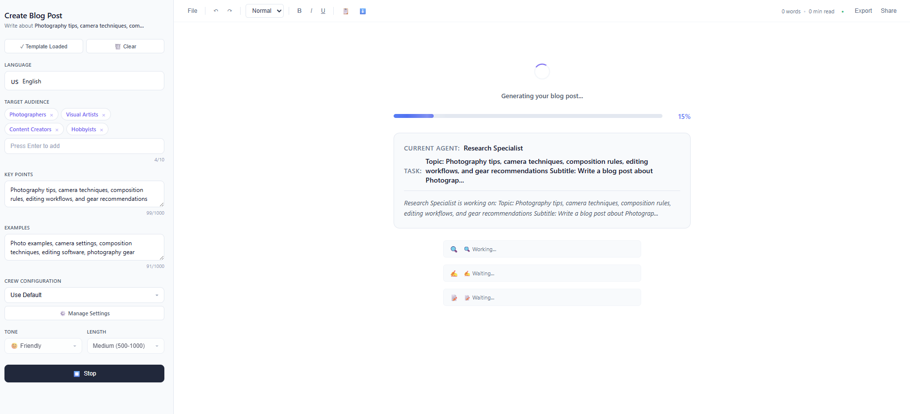
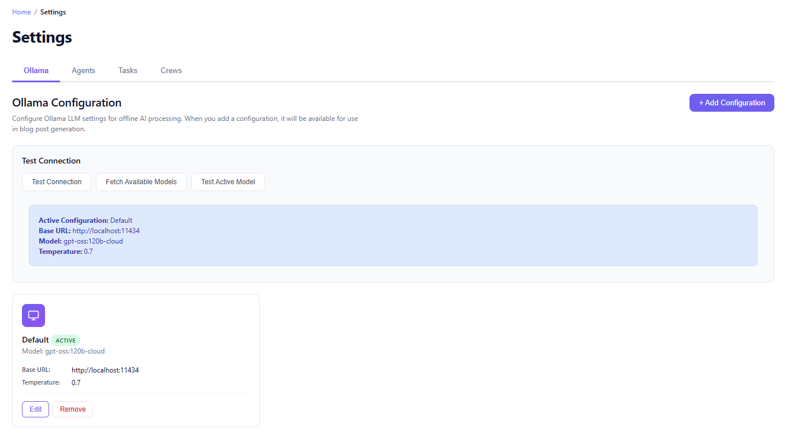
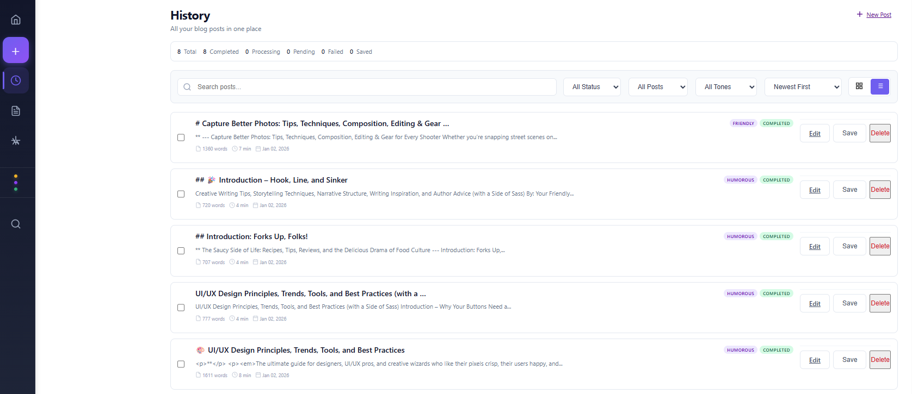
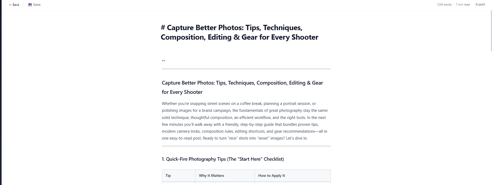

# Blog Post Builder with CrewAI & Ollama

A powerful Django web application that leverages CrewAI's multi-agent system and Ollama's local LLM capabilities to automatically generate high-quality blog posts. The system employs specialized AI agents working collaboratively to research, write, and edit content with complete privacy and no API costs.


## ✨ Features

- 🤖 **Multi-Agent System**: Specialized agents (Researcher, Writer, Editor) collaborate to create content
- 🎨 **Modern Web Interface**: Clean, responsive design with real-time progress tracking
- ⚙️ **Advanced Configuration**: Customize agents, tasks, and crew workflows
- 🔄 **Real-Time Processing**: Background task processing with live status updates
- 🏠 **Local LLM Support**: Complete privacy with Ollama - no API costs
- 📝 **Content Management**: Save, search, and edit generated blog posts

## 📸 Screenshots

<div align="center">
  
  
</div>

<div align="center">
  
  
</div>

<div align="center">
  
  
</div>

## 🚀 Quick Start

### Prerequisites

- **Python 3.8+** installed
- **Ollama** installed and running ([Download](https://ollama.ai))
- **Ollama Model** downloaded: `ollama pull llama3`

### Installation

#### Windows

```bash
# Run setup script
setup.bat

# Activate virtual environment
venv\Scripts\activate

# Configure environment (edit .env file)
# OLLAMA_BASE_URL=http://localhost:11434
# OLLAMA_MODEL=llama3
# DJANGO_SECRET_KEY=your-secret-key-here

# Run migrations
python manage.py migrate

# Start server
python manage.py runserver
```

#### Linux/Mac

```bash
# Make setup script executable and run
chmod +x setup.sh
./setup.sh

# Activate virtual environment
source venv/bin/activate

# Configure environment (edit .env file)
# OLLAMA_BASE_URL=http://localhost:11434
# OLLAMA_MODEL=llama3
# DJANGO_SECRET_KEY=your-secret-key-here

# Run migrations
python manage.py migrate

# Start server
python manage.py runserver
```

Then open your browser and navigate to `http://127.0.0.1:8000`

## 📚 Documentation

- **[Architecture](docs/ARCHITECTURE.md)** - System architecture and design
- **[API Documentation](docs/API.md)** - Complete API reference
- **[Configuration Guide](docs/CONFIGURATION.md)** - Environment and settings configuration
- **[Usage Guide](docs/USAGE.md)** - How to use the application
- **[Troubleshooting](docs/TROUBLESHOOTING.md)** - Common issues and solutions
- **[Development Guide](docs/DEVELOPMENT.md)** - Contributing and development setup

## 🏗️ Project Structure

```
crewai-blog-builder/
├── manage.py                 # Django management script
├── requirements.txt          # Python dependencies
├── setup.bat / setup.sh         # Setup scripts
├── readme_images/            # Screenshots and images
├── docs/                     # Documentation files
├── blog_builder/             # Django project settings
└── blog_app/                 # Main application
    ├── models.py             # Database models
    ├── views.py              # API endpoints
    ├── agents/               # CrewAI agent definitions
    ├── templates/            # HTML templates
    └── static/               # CSS and JavaScript
```

## 🛠️ Technologies Used

- **Django 4.2+** - Web framework
- **Django REST Framework** - RESTful API
- **CrewAI** - Multi-agent orchestration
- **Ollama** - Local LLM inference
- **LiteLLM** - LLM abstraction layer
- **SQLite** - Database (default)

## 🤝 Contributing

Contributions are welcome! Please see [Development Guide](docs/DEVELOPMENT.md) for details.

1. Fork the repository
2. Create a feature branch (`git checkout -b feature/amazing-feature`)
3. Commit your changes (`git commit -m 'Add some amazing feature'`)
4. Push to the branch (`git push origin feature/amazing-feature`)
5. Open a Pull Request

## 📄 License

This project is open source and available for personal and commercial use.

## 💬 Support

For issues and questions:
- Open an issue on the project repository
- Check the [Troubleshooting Guide](docs/TROUBLESHOOTING.md)
- Review Django and CrewAI documentation

---

**Built with ❤️ using Django, CrewAI, and Ollama**

*Generate high-quality blog posts with AI agents, completely offline and private.*
